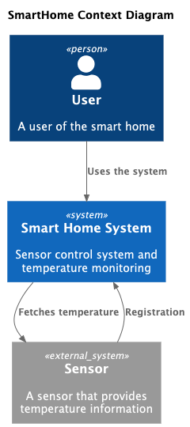
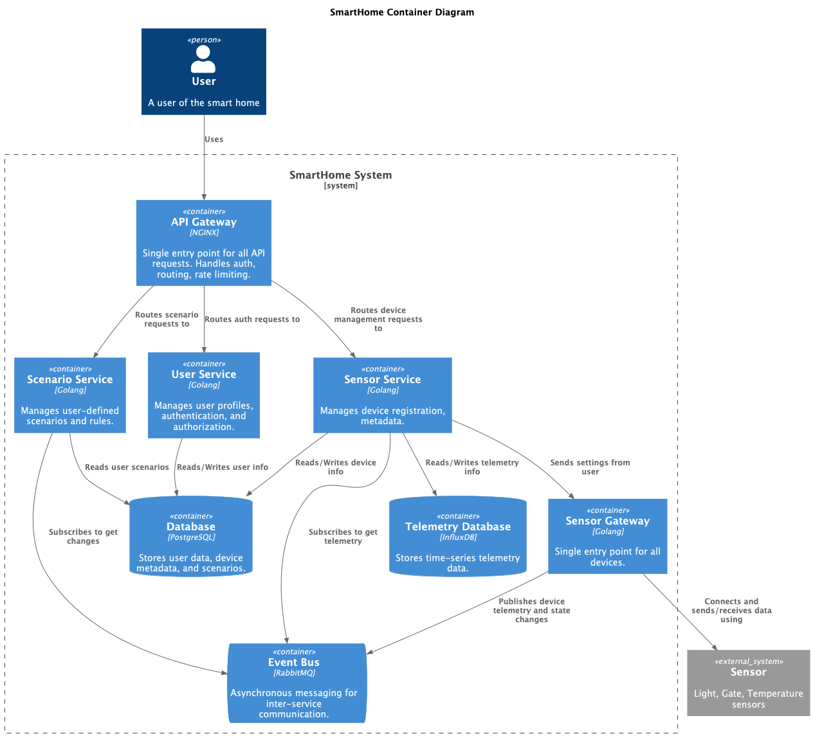
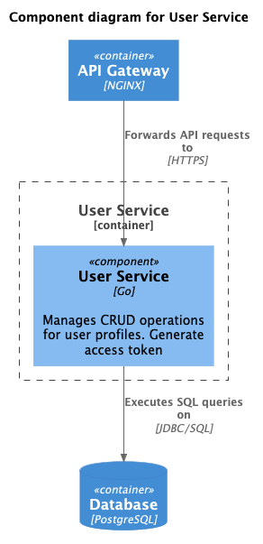
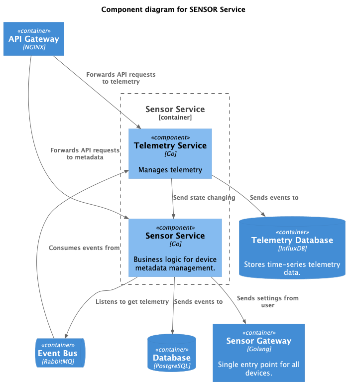
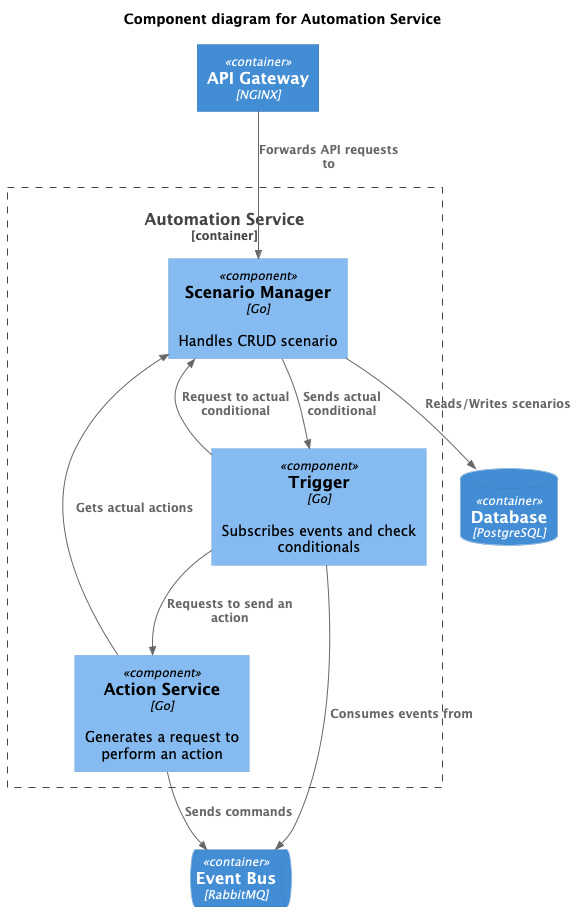
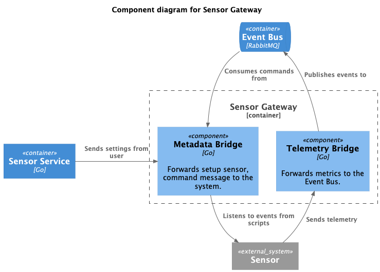
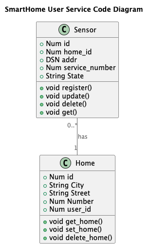
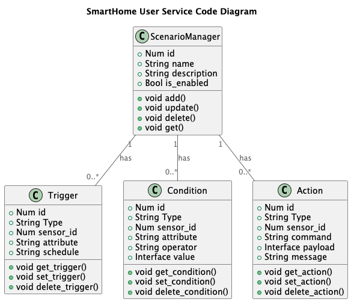
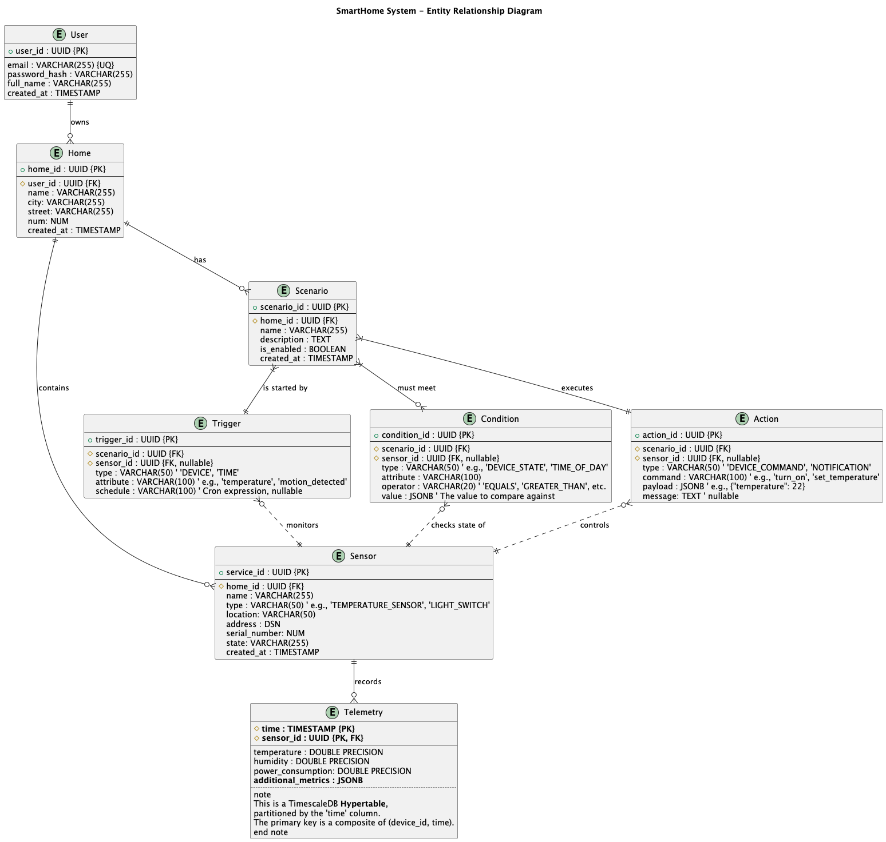

# MVP «Тёплый дом»

Это решение проектной работы первого спринта. 

# Задание 1. Анализ и планирование

### 1. Описание функциональности монолитного приложения

**Управление отоплением:**

- Пользователи могут удалённо включать/выключать отопление в своих домах.

**Мониторинг температуры:**

- Пользователи могут узнать актуальную температуру по локации, по идентификатору.


### 2. Анализ архитектуры монолитного приложения

Язык программирования: Go

База данных: PostgreSQL

Архитектура: Монолитная, все компоненты системы (обработка запросов, бизнес-логика, работа с данными) находятся в рамках одного приложения.

Взаимодействие: Синхронное, запросы обрабатываются последовательно. Данные о температуре также получаются через запрос от сервера к датчику.


### 3. Определение доменов и границы контекстов

- Домен «Управление устройствами» 
    - поддомен управление устройством
      - контекст: добавление, удаление и обновление устройств
- Домен «Мониторинг температуры»
    - поддомен мониторинг температуры
      - контекст: получение информации о температуре с устройств и вывод пользователям 


### **4. Проблемы монолитного решения**

- Масштабируется приложение целиком, хотя домен "Мониторинг температуры" выглядит более нагруженным, чем "Управление устройствами"
- Отказ одного компонента может привести к отказу всего сервиса
- При обновлении системы необходим запуск всего приложения и тестирования всех компонент
- При сетевой недоступности сенсоров мы не сможем вернуть данные клиентам


### 5. Визуализация контекста системы — диаграмма С4



# Задание 2. Проектирование микросервисной архитектуры

В этом задании вам нужно предоставить только диаграммы в модели C4. Мы не просим вас отдельно описывать получившиеся микросервисы и то, как вы определили взаимодействия между компонентами To-Be системы. Если вы правильно подготовите диаграммы C4, они и так это покажут.

**Диаграмма контейнеров (Containers)**



**Диаграмма компонентов (Components)**

Основные функции User Service:
- CRUD пользователя;
- Аутентификация пользователя и выдача access_token;

Диаграмма User Service:



Основные функции Sensor Service:
- Авторизация пользователя (проверка пользователя и выдача ему прав);
- CRUD домов и сенсоров;
- Чтение и запись телеметрии.

Диаграмма Sensor Service:



Основные функции Scenario Service:
- Авторизация пользователя (проверка пользователя и выдача ему прав);
- CRUD сценариев;
- По шине событий получать изменения и проверять условие;
- Отправлять запрос на выполнение действий, если условие выполнено.

Диаграмма Scenario Service:



Диаграмма Sensor Gateway:



**Диаграмма кода (Code)**

Диаграмма Sensor Service:



Диаграмма Scenario Manager:



# Задание 3. Разработка ER-диаграммы

Добавьте сюда ER-диаграмму. Она должна отражать ключевые сущности системы, их атрибуты и тип связей между ними.



# Задание 4. Создание и документирование API

Микросервисы:
- UserService
- SensorService
- ScenarioService
- SensorGateway

Дополнительные сервисы:
- ApiGateway (nginx)
- EventBus
- DB (postgres)
- TelemetryDB (InfluxDB)

### 1. Тип API

| Тип API    | Сервис, инициализирующий запрос | Сервис, к кому инициализируется запрос | Обоснование                                                                                                 |
|------------|---------------------------------|----------------------------------------|-------------------------------------------------------------------------------------------------------------|
| REST       | Api Gateway                     | User Service                           | Синхронный запрос для CRUD-операций                                                                         |
| REST       | Api Gateway                     | Sensor Service                         | Синхронный запрос для CRUD-операций                                                                         |
| WebSocket  | Api Gateway                     | Sensor Service (telemetry service)     | Для вывода в real-time режиме телеметрию                                                                    |
| REST       | Api Gateway                     | Scenario Service                       | Синхронный запрос для CRUD-операций                                                                         |
| REST       | Sensor Service                  | Sensor gateway                         | Запрос должен быть синхронным, чтобы сразу получить ответ                                                   |
| AsyncAPI   | Scenario Service                | Sensor gateway                         | Отправляет команды для выполнения (слабая связанность, высокая отказоустойчивость, нам необязательно ждать) |
| AsyncAPI   | Sensor gateway                  | Scenario Service                       | Отправляет события, по которым может сработать триггер (не нужно опрашивать Sensor gateway каждый раз)      |
| AsyncAPI   | Sensor gateway                  | Sensor Service                         | Отправляет телеметрию и события (не нужно опрашивать Sensor gateway каждый раз)                             |

### 2. Документация API

Документация была разработана только для синхронных запросов, использующий REST для взаимодействия.
Как запустить Swagger:
```bash
docker run -p 81:8080 -v ./schemas:/schemas -e SWAGGER_JSON=/schemas/sensor-service.json docker.swagger.io/swaggerapi/swagger-ui
```
И в веб-браузере будет доступен Swagger UI по адресу http://127.0.0.1:81.

# Задание 5. Работа с docker и docker-compose

1) temperature-api - простое приложение, которое имметирует работу сенсора.

    Язык: Go
   Обрабатывает только 2 handlers:
    - GET `/temperature?location=`
    - GET `/temperature/:id`

    
2) Приложение упаковано в docker-файл и описан в docker-compose:
```yaml
temperature-api:
build:
  context: temperature-api
  dockerfile: Dockerfile
container_name: temperature-api
environment:
  - PORTS=8081
ports:
  - "8081:8081"
restart: unless-stopped
networks:
  - smarthome-network
```

3) Также в docker-compose добавлена база данных на основе postgresql:
```yaml
postgres:
image: postgres:16-alpine
container_name: postgres
environment:
  - POSTGRES_USER=postgres
  - POSTGRES_PASSWORD=postgres
ports:
  - "5432:5432"
networks:
  - smarthome-network
healthcheck:
  test: [ "CMD-SHELL", "pg_isready -U postgres -d smarthome" ]
  interval: 10s
  timeout: 5s
  retries: 5
  start_period: 30s # Optional: Time to wait before first health check
volumes:
  - ./smart_home/init.sql:/docker-entrypoint-initdb.d/init.sql
  - postgres_data:/var/lib/postgresql/data
restart: always
```

# **Задание 6. Разработка MVP**

Из всей функциональности был реализован микросервис sensor-service, который отвечает за управление сервисами. 
Был добавлен функционал для управления домами.
